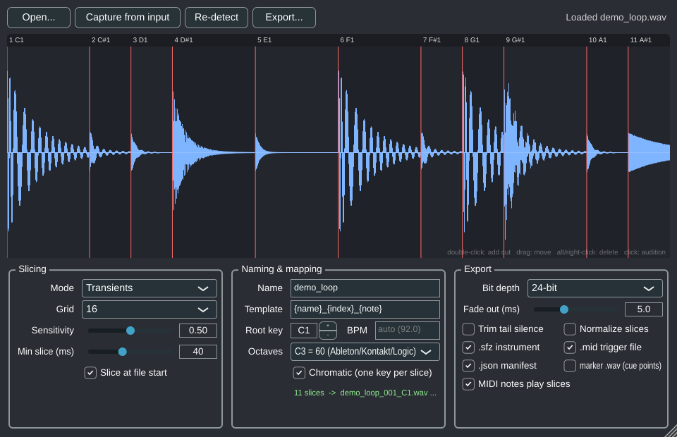

# Sample Chopper

Split audio at transients and export every slice as its own, sampler-ready audio
file — with a naming convention that sample players auto-map, plus the companion
files that carry the slice timing. Runs as a **VST3 / AU plugin inside Ableton**
(or any DAW), as a **standalone app**, and as a **command-line tool**.



```
Break.wav  ──►  Break_001_C1.wav   Break_002_C#1.wav   Break_003_D1.wav ...
                Break.sfz          (one key per slice; opens in most samplers)
                Break.mid          (one note per slice at the original timing)
                Break.json         (all slice positions, for scripts)
                Break_markers.wav  (optional: the source with cue points)
```

## Why these outputs (and why no `.rex`)

- **Individual WAVs, zero-padded index + note name.** Ableton's Drum Rack and
  Simpler, Kontakt, Logic's Sampler, Battery, MPC, Decent Sampler and friends
  either map dropped files in alphabetical order (the `001`, `002`... index keeps
  that right) or read the note name from the filename (`C1`, `C#1`...). Every
  slice also carries a `smpl` chunk with its root key, which Kontakt, Logic,
  Reason, Bitwig, Renoise and MPC read directly.
- **`.mid` trigger file.** This is what people actually use a REX file *for*: drop
  the MIDI clip on a track holding the slices and the loop plays back at any
  tempo. Ableton's own "Slice to MIDI" produces the same pair.
- **`.sfz`.** An open, text-based instrument that maps each slice to its key.
- **`.rex` / `.rx2` is not generated.** REX2 is a proprietary Reason Studios
  format. They license a read-only SDK and the only writer is ReCycle; there is
  no legal way to write one from third-party code. The MIDI + SFZ + JSON set
  carries the same information in open formats.

## Building

On a Mac with Xcode installed, one command builds everything, runs the tests
and installs the VST3 and AU into your user plug-in folders:

```bash
./scripts/build-mac.sh
```

Requirements: CMake 3.22+, a C++17 compiler (Xcode on macOS, Visual Studio 2022
on Windows, GCC/Clang on Linux). JUCE 8 is fetched automatically on first
configure (network needed once).

```bash
cmake -S . -B build -DCMAKE_BUILD_TYPE=Release
cmake --build build --config Release
```

Outputs:

| Target | Where |
|---|---|
| VST3 | `build/plugin/SampleChopper_artefacts/Release/VST3/Sample Chopper.vst3` |
| AU (macOS only) | `build/plugin/SampleChopper_artefacts/Release/AU/Sample Chopper.component` |
| Standalone app | `build/plugin/SampleChopper_artefacts/Release/Standalone/` |
| CLI | `build/cli/chopper` |
| Tests | `build/tests/chopper_tests` (or `ctest --test-dir build`) |

Add `-DSC_COPY_PLUGIN_AFTER_BUILD=ON` to install the plugin into your user
plugin folders after each build (`~/Library/Audio/Plug-Ins/...` on macOS).
`-DSC_BUILD_PLUGIN=OFF` builds only the core, CLI and tests (no JUCE needed).

Linux plugin builds need the usual JUCE packages:
`libasound2-dev libcurl4-openssl-dev libx11-dev libxrandr-dev libxinerama-dev libxcursor-dev libxext-dev libfreetype-dev libfontconfig1-dev libgl1-mesa-dev`.

GitHub Actions (`.github/workflows/build.yml`) builds macOS, Windows and Linux
on every push and uploads the plugin bundles as artifacts, so you can grab
binaries without a local toolchain.

## Using it inside Ableton

1. Put **Sample Chopper** on the audio track that holds the loop (Audio Effects
   list; it passes audio through untouched).
2. Click **Capture from input**, press **Play** in Live, let the loop run once,
   press **Stop**. The recording appears in the plugin. (Or drag a file onto the
   window / click **Open...**.)
3. Adjust **Sensitivity** and **Min slice** until the cuts look right.
   Double-click to add a cut, drag to move one, alt-click or right-click to
   delete, click a slice to hear it. Yellow markers are manual, red are detected.
4. Set **Name**, **Template** and **Root key**, then **Export...** and pick a
   folder. Drag the folder of WAVs onto a Drum Rack, or the `.sfz` into any
   SFZ-capable sampler, and the `.mid` onto a MIDI track.

With **MIDI notes play slices** on, a MIDI track routed to the plugin plays the
slices from the root key upward, so you can audition or resequence before
exporting.

## Command line

```bash
python3 tools/make_demo_loop.py demo.wav --bpm 92      # synthesise a test loop
./build/cli/chopper --in demo.wav --dry-run             # list the slices
./build/cli/chopper --in demo.wav --out ./demo_slices --name Break --root C1 --markers
./build/cli/chopper --help                              # every option
```

### Naming template tokens

| Token | Meaning | Example |
|---|---|---|
| `{name}` | base name | `Break` |
| `{index}` / `{index:2}` | 1-based slice number, zero-padded (default 3 digits) | `007` / `07` |
| `{note}` | key name of the slice | `C#1` |
| `{midi}` | key as MIDI number | `37` |
| `{bpm}` | tempo (given, or estimated from loop length) | `92` |
| `{ms}` / `{len}` | start / length in milliseconds | `1304` / `163` |
| `{count}` | total number of slices | `12` |

Default: `{name}_{index}_{note}` → `Break_001_C1.wav`. Octave numbering follows
the Ableton / Kontakt / Logic convention (C3 = MIDI 60); switch to C4 = 60 for
Cubase-style names. Sharps can be written `C#1`, `Cs1` or `Db1`.

## How detection works

Spectral flux over a log-spaced band filterbank (6 bands per octave, so kicks
and bass count as much as hats), log-compressed so quiet ghost notes register,
adaptive threshold against the local mean, minimum-spacing suppression, then a
sample-accurate refinement that finds the attack in a fine peak envelope, backs
off by a 1 ms pre-roll and snaps to a zero crossing. Slices get a 0.5 ms fade-in
and a 5 ms fade-out by default so cuts never click. **Grid** mode ignores
transients and cuts the file into equal divisions.

## Layout

```
core/     pure C++17 library: detection, slicing, WAV/SFZ/MIDI/JSON writers (no JUCE)
cli/      chopper command-line tool
tests/    self-contained test suite for the core
plugin/   JUCE plugin: processor, editor, waveform view
tools/    make_demo_loop.py
```

## License

GPL-3.0 (see `LICENSE`). JUCE is used under its GPLv3 option; a commercial JUCE
license is needed to ship closed-source builds.
